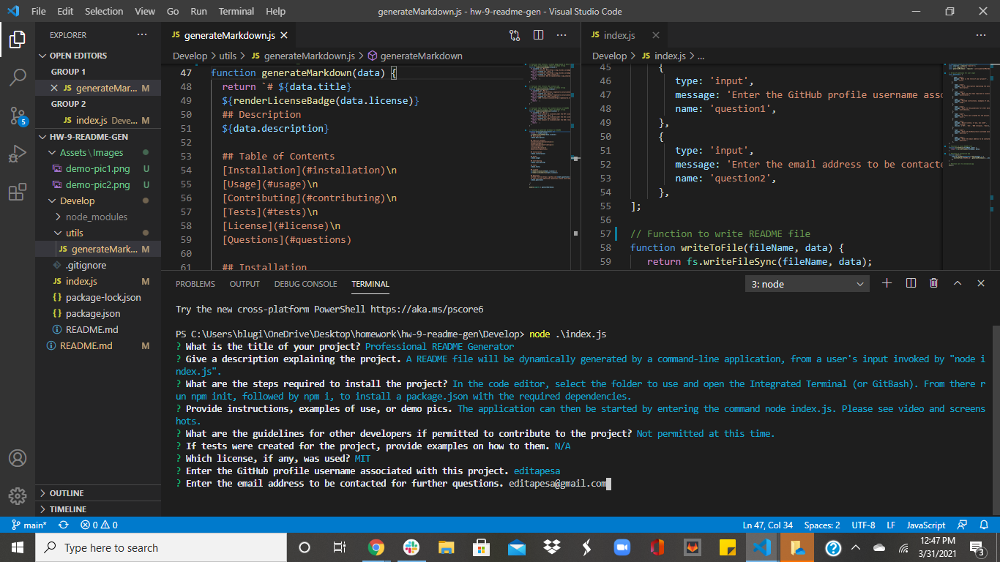

# Professional README Generator

## Description
A high quality README file is important to have when creating projects as a developer. It is the first thing someone sees when viewing a repository, and contains important information about the project. In this assignment, a README file will be dynamically generated by a command-line application, from a user's input using the `inquirer package`. This can help a developer save time that can be used for creating projects. After entering the prompted information, the following will be achieved:
- A professional README file will be generated with the title of the project and sections named Description, Table of Contents, Installation, Usage, License, Contributing, Tests, and Questions.
- The project title entered will be displayed as the title of the README.
- The responses for the Description, Installation, Usage, Contributing, Tests, License, and Questions prompts will be displayed in their respective titled sections.
- Whichever license is chosen the associated badge will appear towards the top of the README. A brief explanation of which license was chosen and a link to a more detailed description will be diplayed in the License section. 
- A link to the GitHub profile of the GitHub username entered will appear in the Questions section.
- The email address entered will also appear in the Questions section with instructions in case there are any additional questions.
- The categories in the Table of Contents can be clicked to go to the corresponding section.

## Installation
In the code editor, select the folder to use and open the Integrated Terminal (or GitBash). From there run `npm init`, followed by `npm i`, to install a `package.json` with the required dependencies. The application can then be started by entering the command `node index.js`.

## License
[BSD 2-Clause License](https://opensource.org/licenses/BSD-2-Clause)

This project is licensed under the BSD 2-Clause License.

## Usage
Click the link below to see a video of how the application works.

[README Generator](https://drive.google.com/file/d/1aXDNXXNMvm4AK1qYRr49YgJ2et3cNTwl/view)

